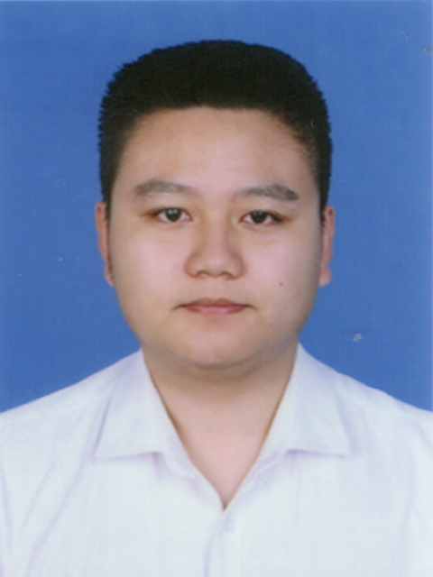

 

<link rel="stylesheet" href="https://use.fontawesome.com/releases/v5.0.13/css/all.css">

# 个人基本信息

</img>
 - `姓名`：**李一喆**
 - `年龄`：23岁
 - `兴趣`：烧菜、室内设计、ACGN
 - `联系电话`：13230379995
 - `电子邮件`：<takenoko1997@foxmail.com>
<!-- - `个人主页`：<https://uchi.takenoko1997.ink>-->
 - `职业意向`：软件工程相关
<!--
<table id="personal" style="border:0; width=100%">
<tr>
<td colspan="10">姓名： 李一喆 年龄：23岁政治面貌：团员</td>
<td colspan="2" rowspan="4"></img></td>
</tr>
<tr><td colspan="10">03</td></tr>
<tr><td colspan="10">04</td></tr>
<tr><td colspan="10">05</td></tr> 
</table>-->

# 教育经历

本科就读并毕业于**中国科学技术大学**。

`2015.09～2016.06` 本科一年级于信息科学学院学习。主修课程：C语言基础、电子技术基础、数据结构与数据库等。

`2016.09～2018.04` 本科二、三年级于数学科学学院基础数学专业学习。主修课程：数学分析、实分析、复分析、泛函分析、微分方程等。

`2018.09～2020.06` 本科三（留）、四年级于数学科学学院应用数学学习。主修课程含：图论、计算机图形学、小波分析、算法基础、数学建模、运筹学等。

`2020.09～2021.06` 于学校做科研助理（劳务协议）。

`本科加权平均分数`：78/100

# 获得奖励

`2015.10` 获得校入学三等奖学金。

`2016.05` 获得校数学建模比赛三等奖。

# 基本能力

除上述提及的主修课程涉及到的知识以外，所掌握的基本能力有：
 - **外国语：**英语：CET4/CET6通过、TOEFL 87分。日语：N1通过。长期阅读日/英语外文材料。
 - **基本编程能力：**
   * C/C++：具有合规范地编写C/C++代码的能力，并使用QMake/CMake等构建项目。写过OpenGL渲染、图像处理相关代码。
   * 原生JS/HTML/CSS：具有基本的使用原生JS写前端界面的能力，使用过Vue框架。使用WebGL写过N-S方程求解示意。
   * Mathematica、LaTeX：能够使用Mathematica进行科学计算分析和使用LaTeX撰写文档。

# 社会实践

 - **活动组织**：在大二期间曾组织中学同学聚会，时间为半日。
 - **集体活动**：
   * 在大二期间参加三下乡活动，在肥西县做民生调查和中学走访。时间为一周。
   * 在大三期间参加赴日交流活动，参观工业企业和进行大学生交流。时间为两周。
 - **勤工俭学**： 在大四期间于某媞蛋糕店打短工。时间为一个月。

# 自我描述

本人比较沉稳，有不断获取新信息和学习新技术的偏好，适合且可以承担稍有难度的工作。希望在工作中积累更多经验、承担有趣的任务。
